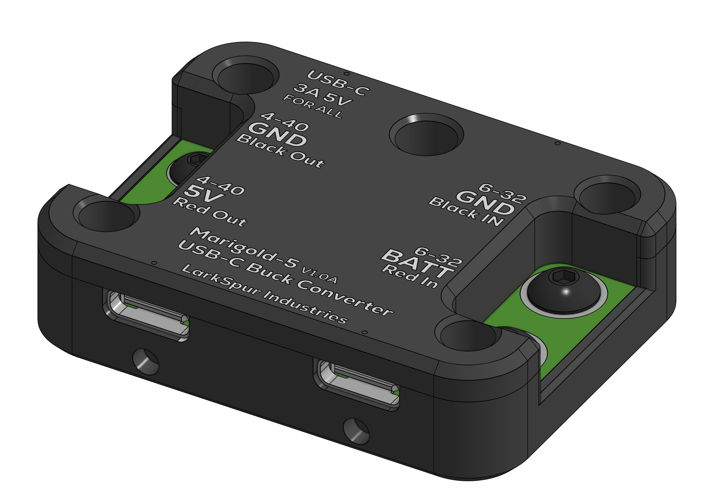
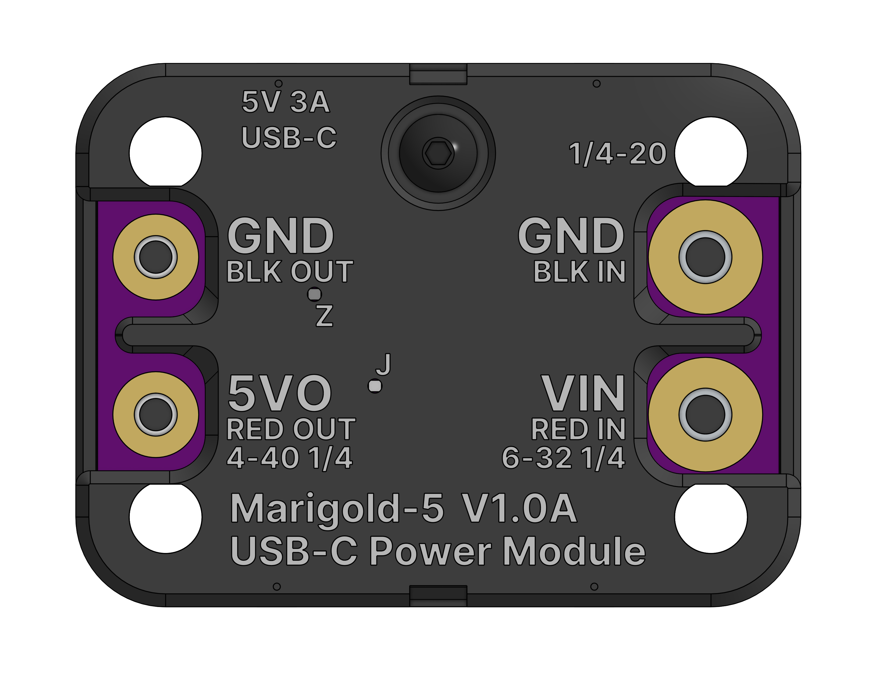
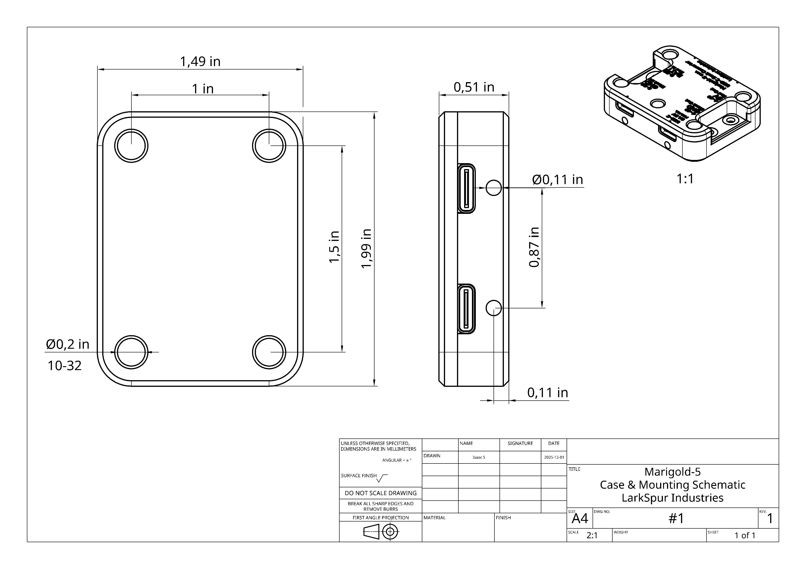
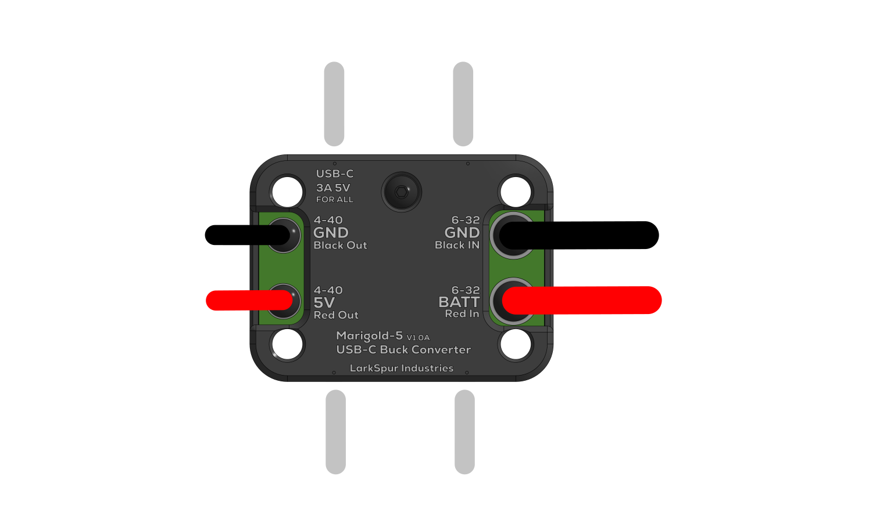

# Marigold-5 Technical Documentation

## 1. Device Overview {#overview}

*Figure 1.1: Corner View*

The **Marigold-5** is a synchronous step-down (buck) DC-DC converter module designed to provide a regulated 5.1V rail for FIRST Robotics Competition applications. It accepts a wide input voltage range (7V–18V) suitable for FRC lead-acid battery architecture and distributes power via four USB-C receptacles and one auxiliary output.

Built around the **Texas Instruments TPS56A37**, it solves the common headache of powering co-processors (Raspberry Pi, Orange Pi) and other devices, such as network equipment, by providing robust, high-current 5V power with secure mounting.

---

## 2. Key Features {#features}

- **4× High-Current USB-C Ports:** Rated for 3A per port (10A System Total)
- **Type-C Current Advertisement:** Uses standard 10 kΩ CC pull-up resistors to advertise 3A capability to non-PD sink devices
- **Secure FRC Mounting:** Bolts directly to 1×2" aluminum extrusion using a standard #10-32 hole pattern
- **Integrated Thermal Management:** Embedded aluminum heatsink block couples directly to the robot frame
- **Protection Suite:** Reverse polarity (PMOS), Input TVS diode (Spikes), and Output Overcurrent (Resettable Fuse)

---

## 3. Electrical Architecture {#electrical}

### 3.1 Power Stage

| Parameter | Specification |
|-----------|---------------|
| Controller IC | TI TPS56A37RPAR |
| Input Voltage (VIN) | 7.0V - 18.0V DC |
| Output Voltage (VOUT) | 5.1V ± 2% (Fixed) |
| Continuous Load | 10A Total |
| Switching Freq | 500 kHz |

### 3.2 USB-C Configuration

**Role:** Source (DFP)  
**CC Config:** 10 kΩ Pull-up to 5.1V (Legacy 3A Advertisement)  
**Data Lines:** D+/D- Floating (Power Only)

> **Note:** This device does not support USB-PD negotiation for voltages > 5V.

### 3.3 Why 5.1V Instead Of 5V?

The 5.1V output is **intentional**. Many USB cables, especially longer or lower-quality ones, introduce resistance (typically 0.1–0.5Ω). At 3A load, this creates a voltage drop of **0.3V–1.5V**. Starting at 5.1V ensures the device receives ≥4.75V at the connector, staying within USB spec even under full load.

Many high-quality USB power supplies output 5.1V–5.2V for the reasons above. This is especially common in industrial and embedded applications, such as FRC Robots, where cable runs may be longer or current demands higher.

---

## 4. Mechanical & Thermal {#mechanical}

**Dimensions:** 1.99" x 1.49" x 0.51" (50.5mm x 37.8mm x 13mm)  
**Weight:** ~45g  
**Case Material:** PETG (Black)

*Figure 4.1: Top Mechanical View*

*Figure 4.2: Case Drawing*

### Thermal Design

At full 10A load, the regulator dissipates approx. 3-4W. The PCB has an **aluminum heatsink block** bonded to the bottom side. When bolted to a 1x2" aluminum tube, the robot frame acts as a thermal reservoir, removing the need for fans, similar to the Vivid Hosting's robot radio.

**Recommended Operating Conditions:**
- Ambient temperature: -10°C to +60°C
- Maximum case temperature: 85°C at full load
- Thermal derating: Begin at 50°C ambient

---

## 5. Pinouts & Wiring {#pinout}

### 5.1 Input Power (VIN)

**Connector:** #6-32 Ring Terminal Studs

- **RED (Side A):** +12V Input (PDH Port on robot)
- **BLACK (Side B):** GND (PDH Port on robot)

**Wire Gauge:** Use 16 AWG or larger for currents above 5A.

### 5.2 Auxiliary Output

**Connector:** #4-40 Ring Terminal Studs

- **RED:** +5.1V Output
- **BLACK:** GND

*Usage: For any other devices on the aux output such as fans, LEDs, arduino/similar, or logic shifters. They also share the 10A total device limit.*

*Figure 5.1: Wiring Diagram*

### 5.3 USB-C Ports

All four USB-C ports are connected in parallel and current-limited at the device level. Each port advertises 3A capability via CC resistors.

We recommend at most powering 2-3 coprocessors (Raspberry Pi, Orange Pi). The remaining port can be used for other devices. The total current draw should not exceed 10A.

**Typical Use Cases:**
- Raspberry Pi 4/5 (2-3A typical)
- Orange Pi 5 (2-3A typical)
- Arduino/ESP32 (0.2-0.5A typical)
- LED strips (varies)

---

## 6. Downloads & Resources {#downloads}

BUTTON("Getting Started Guide", "pdf/Marigold-5_V1.0A-GettingStarted.pdf", "_blank")
BUTTON("Case Drawing PDF", "pdf/Marigold-5_V1.0A-CaseDrawing.pdf", "_blank")
BUTTON("STEP File", "3d/Marigold-5_V1.0A.step")

---

## 7. Installation Guide {#installation}

### Step 1: Mounting

1. Identify a suitable mounting location on your robot's aluminum frame (1x2" extrusion recommended)
2. Align the four #10-32 mounting holes with your frame
3. Use four #10-32 screws to secure the module firmly
4. Ensure good thermal contact between the heatsink and frame

### Step 2: Input Power

1. Connect the **INPUT** 6-32 ring terminal studs to one of the robot's PDH ports
2. Use a 15-20A breaker in the PDH port to prevent permanent damage to the device
3. Torque down the 6-32 bolts until snug. Do not over-tighten!

### Step 3: USB-C Devices

1. Connect your co-processors and peripherals via USB-C cables
2. Make sure device total current draw does not exceed 10A
3. Use high-quality USB-C cables rated for 3A+

### Step 4: Testing

1. Apply power to the robot
2. Verify 5.1V output with a multimeter
3. Check that all USB devices power on correctly
4. Run at full load for 10 minutes and check temperature

---

## 8. Troubleshooting {#troubleshooting}

### Device Not Powering On

- Check input voltage is between 7-18V
- Verify polarity (red = +12V, black = GND)
- Disconnect device for several minutes and wait for internal polyfuse to reset

### USB Devices Not Being Powered

- Verify cable supports power delivery, try a different cable.
- Check total device current draw < 10A 
- Some devices may require USB data negotiation (not supported). However most should work with legacy 3A advertisement.

### Overheating

- Reduce total device current draw
- Improve thermal contact with robot frame, check heatsink.
- Ensure adequate airflow around the module
- Check ambient temperature < 60°C

### Understanding Brownouts

**What is a brownout?**
During high-current maneuvers (acceleration, pushing matches), the robot battery voltage can sag from 
12.5V down to 6-7V for several seconds. This is normal FRC battery behavior.

**Why does this matter for co-processors?**
Most generic 12V→5V USB adapters have a minimum input voltage of 9-10V. When battery voltage drops 
below this threshold, the adapter shuts down, rebooting your co-processor.

**How Marigold-5 solves this:**
The TPS56A37 buck converter maintains stable 5.1V output down to 7V input. During a match
when your battery sags to 7.5V, Marigold-5 keeps the power running stable for all devices connected.

---

## 9. LED Indicators {#led-indicators}

### 5V GOOD LED

- Green: 5V rail is stable
- Off: 5V rail has no power from internal regulator

### REG GOOD LED

- Orange: Internal regulator is stable and operating correctly
- Off: Internal regulator is unstable or has failed

---

## 10. Safety & Compliance {#safety}

**WARNINGS:**
- Do not exceed 18V input voltage
- Do not exceed 10A total output current
- Do not operate without proper mounting (thermal management)
- Keep away from water and conductive debris, such as drill shavings. 

**FRC Compliance:**
This device is designed for FIRST Robotics Competition use and complies with FRC power distribution rules. Always verify game manual rules before competition!

---

## 11. Support {#support}

For technical support, questions, or feedback:

- **Email:** [larkspur.industries.official@gmail.com](mailto:larkspur.industries.official@gmail.com)
- **GitHub:** [github.com/LarkSpur-Industries](https://github.com/LarkSpur-Industries)

---
