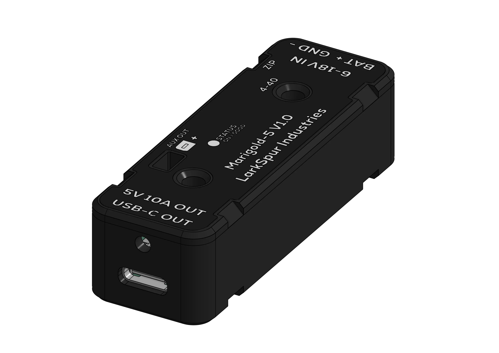
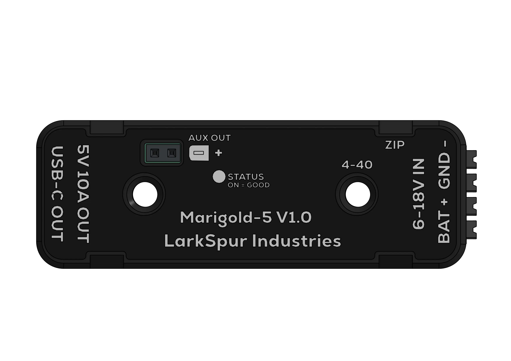
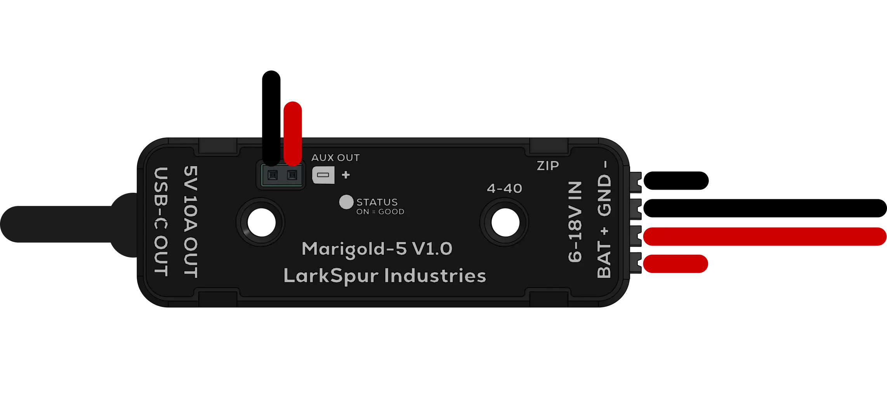
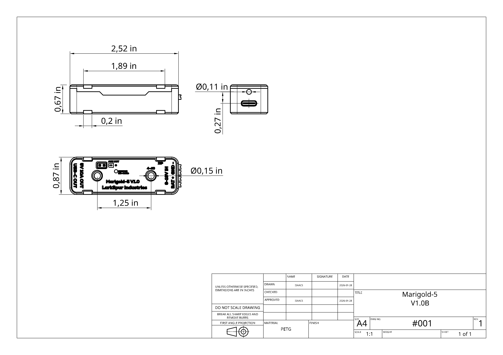

# Marigold-5 Documentation

## 1. Device Overview {#overview}

*Figure 1.1: Marigold-5 Corner View*

The **Marigold-5** is a synchronous step-down (buck) DC-DC converter module designed to provide a regulated 5.1V rail for FIRST Robotics Competition applications. It accepts a wide input voltage range (6V–18V) suitable for FRC lead-acid battery architecture and distributes power via a single high-current USB-C receptacle and one auxiliary output.

Built around the **Texas Instruments TPS56A37**, the Marigold-5 solves the common challenge of reliably powering co-processors (Raspberry Pi, Orange Pi) and other devices like network equipment with robust, high-current 5.1V power and secure mounting options.

---

## 2. Key Features {#features}

- **High-Current USB-C Port:** Rated for 3A continuous per port, 10A system total
- **Type-C Current Advertisement:** Uses standard 10 kΩ CC pull-up resistors to advertise 3A capability to non-PD sink devices
- **Brownout Protection:** Maintains stable 5.1V output down to 6V input, keeps your co-processor running during battery voltage sags
- **Secure Mounting:** Bolts directly to 1×2" aluminum extrusion using standard #4-40 hardware with 1.25" spacing, or use integrated zip tie points
- **Built-In Protection:** Reverse polarity (PMOS), input TVS diode (voltage spikes), thermal shutdown (165°C), and overcurrent limiting

---

## 3. Safety & Warnings {#safety}

> - **Do not exceed 18V input voltage** - Maximum rated input is 18V DC
> - **Do not exceed 10A total output current** - Combined load across USB-C and auxiliary output
> - **Do not reverse polarity** - Red wire to BATT+, black wire to GND only
> - **Keep away from conductive debris** - Metal shavings, water, or tools can cause short circuits
> - **Ensure adequate airflow** - Device may reach high temperatures under sustained 10A loads

**FRC Compliance:**  
This device is designed for FIRST Robotics Competition use and complies with FRC power distribution rules. Always verify current game manual rules before competition.

---

## 4. Quick Start Guide {#quickstart}

### What You'll Need
- Marigold-5 module
- 16-22 AWG wire (red and black)
- Wire strippers
- 15-20A circuit breaker (for PDH)
- USB-C cable rated for 3A
- Mounting hardware (#4-40 screws or zip ties)

### Installation in 4 Steps

**Step 1: Mount the Device**
1. Identify a mounting location near your co-processor
2. Use either:
   - Two #4-40 screws with 1.25" spacing, or
   - Zip ties through the integrated mounting points
3. Secure firmly but do not over-tighten

**Step 2: Wire Input Power**
1. Strip 7-8mm (approximately 5/16") of insulation from red and black wires
2. Press the **white push button** on the terminal block
3. Insert red wire into **BATT+**, black wire into **GND**
4. Release button and verify by gently tugging both wires
5. Install 15-20A breaker in PDH port **before** connecting to battery

**Step 3: Connect Your Device**
1. Plug USB-C cable into Marigold-5's USB-C port
2. Connect other end to your co-processor (Raspberry Pi, Orange Pi, etc.)
3. If using our locking cable, secure the retention screw to the case

**Step 4: Power On & Test**
1. Turn on robot main power
2. Verify the **STATUS LED** is orange (solid)
3. Check that your co-processor boots normally
4. Optionally, measure 5.1V ± 0.1V at auxiliary output pins with multimeter

---

## 5. Installation Guide {#installation}

### 5.1 Mounting Options

*Figure 5.1: Top View Showing Mounting Points*

The Marigold-5 provides two mounting methods:

**Option 1: Screw Mounting (Recommended)**
- Two #4-40 threaded inserts with 1.25" spacing
- Compatible with standard 1×2" FRC aluminum extrusion
- Use #4-40 screws up to 0.5" length

**Option 2: Zip Tie Mounting**
- Four integrated zip tie points on case perimeter
- Quick installation 
- Recommended for low-vibration applications only

### 5.2 Wiring & Connections

*Figure 5.2: Wiring Diagram*

### Input Power Terminal Block

**Connector:** TBLH10-350-04BK Spring Cage Terminal Block

**Specifications:**
- **Rated Current:** 10A (UL), 17.5A (IEC) per contact
- **Wire Gauge:** 16-24 AWG (0.2-1.5mm²)
- **Strip Length:** 7-8mm (very important)

**Pinout:**
| Pin | Function | Wire Color |
|-----|----------|------------|
| BATT+ | +12V Input | Red |
| BATT+ | +12V Input | Red |
| GND | Ground | Black |
| GND | Ground | Black |

**How to Wire:**
1. **Strip exactly 7-8mm**, too short and the wire won't make contact; too long creates shock hazard
2. Press white push button on top of terminal block
3. Insert stripped wire fully until it bottoms out
4. Release button, spring clamp automatically secures wire
5. Tug-test: Wire should not pull out with moderate force

**Breaker Sizing:**
- Use **15-20A breaker** in your robot's Power Distribution Hub (PDH)
- This protects the device and wiring from sustained overcurrent
- Do not use breakers larger than 20A

**Built-In Protections:**
- **Reverse Polarity Protection:** PMOS prevents damage if wires are swapped
- **Voltage Spike Protection:** TVS diode clamps input transients
- **Undervoltage Lockout (UVLO):** Disables output below 4.2V to prevent unstable operation

#### USB-C Output Port

**Role:** Source (DFP, Downstream Facing Port)  
**Current Advertisement:** 10 kΩ pull-up on CC pins (Legacy 3A capability)  
**Data Lines:** D+/D- floating (power only, no data transfer)  

> **Note:** This device does not support USB Power Delivery (PD) negotiation. It provides fixed 5.1V output. 

**Typical Use Cases:**
| Device | Typical Current Draw |
|--------|---------------------|
| Raspberry Pi 4/5 | 2-4A |
| Orange Pi 5 | 2-5A |
| Arduino/ESP32 | 0.2-0.5A |
| LED Strips | Varies (check specs) |

**Cable Selection:**
- Use cables rated for **3A minimum**
- Avoid cheap cables with thin gauge wire (creates voltage drop)
- Our locking USB-C cable is recommended for on robots

#### Auxiliary Output Header

**Connector:** 2.54mm pitch pin header

| Pin | Function |
|-----|----------|
| (+) | 5.1V Output |
| (-) | Ground |

**Use Cases:**
- Cooling fans
- LED indicators
- Arduino/microcontroller power
- Network switches (5V models)

**Current Sharing:**  
The auxiliary output shares the 10A total system limit with the USB-C port. Example: If USB-C draws 3A, auxiliary header has 7A available.

---

## 6. Understanding the Output Voltage {#voltage-explanation}

### Why 5.1V Instead of 5.0V?

The 5.1V output is **intentional and by design**. Here's why:

**The Problem:**  
USB cables, especially longer or lower-quality ones, introduce resistance (typically 0.1–0.5Ω per meter). At 3A load, Ohm's Law tells us:
- **Voltage drop = Current × Resistance**
- At 3A through 0.3Ω cable: **0.9V drop**

**The Solution:**  
Starting at 5.1V ensures the device at the end of the cable receives ≥4.75V (the USB minimum spec), even under full load with imperfect cables.

**Industry Practice:**  
High-quality USB power supplies output 5.1V-5.2V for exactly this reason. It's standard practice in industrial and embedded applications.

---

## 7. LED Status Indicator {#led-indicator}

### STATUS LED Behavior

Located on top of the case, the STATUS LED provides real-time feedback on device operation.

| LED State | Meaning | Action Required |
|-----------|---------|-----------------|
| 🟠 **Orange (Solid)** | Normal operation - output is stable at 5.1V | None |
| ⚫ **Off** | Fault condition detected | See troubleshooting below |

### What Causes the LED to Turn Off?

The STATUS LED is driven by the TPS56A37's integrated Power Good (PG) function. It turns off when:

1. **Input power disconnected** - Check PDH breaker and wiring
2. **Reverse polarity detected** - Swap red and black wires
3. **Output voltage out of range** - Load draws >10A or output is shorted
4. **Thermal shutdown** - Junction temperature >165°C (improve airflow)
5. **Undervoltage lockout** - Input voltage <4.2V (battery critically low)

The PG circuit includes built-in deglitch timing to prevent false triggers from transients.

---

## 8. Troubleshooting {#troubleshooting}

### Device Not Powering On (STATUS LED Off)

**Check input voltage:**
- Measure voltage at terminal block: should be 6-18V
- If below 6V: Battery is critically discharged or wiring has high resistance
- If above 18V: **Disconnect immediately** - input overvoltage

**Verify polarity:**
- Red wire should be on **BATT+**
- Black wire should be on **GND**
- If reversed, the PMOS protection prevents damage, but device won't operate

**Inspect wiring:**
- Ensure wires are fully inserted into terminal block
- Check for corrosion or loose connections at PDH
- Verify breaker is not tripped (reset if necessary)

**Try power cycle:**
- Disconnect input power for 30 seconds
- Reconnect and observe STATUS LED

---

### USB Devices Not Booting or Charging

**Cable quality issues:**
- Try a different USB-C cable rated for 3A
- Measure voltage at device end: should be >4.75V under load
- Long or thin cables create excessive voltage drop

**Current limit exceeded:**
- Check total load: USB-C + auxiliary output must be <10A combined
- Some devices have inrush current spikes at boot (normal, usually brief)

**Device compatibility:**
- Verify your device accepts 5V input (not 9V, 12V, or 20V PD)
- Some devices require USB-PD negotiation and will not charge from this module

---

### Overheating (Device Feels Very Hot)

**This is usually normal behavior:**
- The Marigold-5 is designed to operate at high temperatures
- At 10A load, the regulator and MOSFETs generate significant heat
- Case acts as heatsink to dissipate this heat to ambient air

**When to take action:**
- If STATUS LED turns off → Thermal shutdown activated (>165°C)
- If device becomes too hot to touch for >2 seconds → Improve airflow

**Solutions:**
- Reduce total load current to <8A
- Mount device in location with better airflow
- Add small 5V fan (powered from auxiliary output) to blow air across case
- Avoid mounting in enclosed boxes without ventilation

---

### Understanding FRC Brownouts

**What is a brownout?**  
During high-current maneuvers (hard acceleration, pushing matches, climbing), the robot battery voltage can sag from 12V down to 6-7V for several seconds. This is **normal FRC battery behavior** due to internal resistance.

**Why does this matter for co-processors?**  
Most generic 12V→5V USB adapters (car chargers, Amazon specials) have a minimum input voltage of 9-10V. When battery voltage drops below this threshold during a brownout, the adapter shuts down, causing your:
- Raspberry Pi to reboot (losing AprilTag tracking mid-match)
- Vision processing to restart (missing critical auto routines)
- NetworkTables to disconnect (breaking driver feedback)

**How Marigold-5 solves this:**  
The TPS56A37 buck converter is designed for **6V minimum input**. During a match when your battery sags to 6-7V, Marigold-5 continues providing stable 5.1V output, keeping your co-processor running without interruption.

---

## 9. Downloads & Resources {#downloads}

### Documentation

BUTTON("Wiring Diagram (PNG)", "img/Marigold-5_V1.0-Wiring.png", "_blank")  
BUTTON("Case Drawing (PDF)", "pdf/Marigold-5_V1.0B_Drawing.pdf", "_blank")

### 3D Models

BUTTON("STEP File", "3d/Marigold-5_V1.0B.step", "_blank")  
BUTTON("GLTF Model", "3d/Marigold-5_V1.0B.gltf", "_blank")

---

## 10. Technical Specifications {#specifications}

### 10.1 Electrical Characteristics

| Parameter | Minimum | Typical | Maximum | Units |
|-----------|---------|---------|---------|-------|
| Input Voltage | 6.0 | 12.0 | 18.0 | V DC |
| Input Surge Voltage | - | - | 22 | V DC |
| Output Voltage | 5.00 | 5.10 | 5.20 | V DC |
| Output Voltage Accuracy | - | ±2% | - | - |
| Continuous Output Current | - | - | 10 | A |
| Peak Output Current | - | - | 12 | A (brief) |
| Switching Frequency | - | 500 | - | kHz |
| Quiescent Current | - | 45 | - | µA |
| Shutdown Current | - | 3 | - | µA |
| Efficiency @ 5A, 12Vin | - | ~90% | - | % |

### 10.2 Protection Features

| Protection | Threshold | Response |
|------------|-----------|----------|
| Reverse Polarity | Any | PMOS blocks current, no damage |
| Input Overvoltage | >22V | TVS diode clamps, may damage if sustained |
| Output Overcurrent | >10A (valley) | Cycle-by-cycle current limiting |
| Output Overvoltage | >125% of target | Shutdown after 32µs deglitch |
| Output Undervoltage | <65% of target | Hiccup mode restart after 256µs |
| Thermal Shutdown | >165°C junction | Automatic shutdown, auto-restart at 135°C |
| Input UVLO | <4.2V rising | Device disabled until Vin >4.2V |

### 10.3 USB-C Port Configuration

| Parameter | Value |
|-----------|-------|
| Port Role | Source (DFP) |
| CC Resistor Configuration | 10 kΩ to VBUS (both CC1 and CC2) |
| Advertised Current | 3A (per USB Type-C spec) |
| Data Lines (D+/D-) | Floating (no data communication) |
| USB-PD Support | No (fixed 5.1V output only) |

### 10.4 Mechanical Specifications

| Parameter | Specification |
|-----------|---------------|
| Dimensions (L × W × H) | 2.52" × 0.87" × 0.67" (64mm × 22mm × 17mm) |
| Weight | ~45g |
| Case Material | PETG (Black) |
| Mounting Hole Pattern | Two #4-40 threaded inserts, 1.25" spacing |
| Mounting Screw Length | 0.5" maximum |
| Operating Temperature | -40°C to +60°C ambient (derated above 50°C) |
| Storage Temperature | -40°C to +85°C |

*Figure 10.1: Mechanical Drawing with Dimensions*

---

## 11. Warranty & Support {#support}

### Warranty Information

**Larkspur Industries provides a warranty on the Marigold-5.**  
For complete warranty terms and RMA process, see our [Warranty Policy](https://larkspurindustries.com/docs-warranty.html).

### Contact Information

For technical support, sales inquiries, or feedback:

- **General Support:** [support@larkspurindustries.com](mailto:support@larkspurindustries.com)
- **Sales & Quotes:** [sales@larkspurindustries.com](mailto:sales@larkspurindustries.com)
- **Engineering Questions:** [engineering@larkspurindustries.com](mailto:engineering@larkspurindustries.com)

### Community Resources

- **GitHub:** [github.com/LarkSpur-Industries](https://github.com/LarkSpur-Industries)
---

**Document Revision:** V1.2 
**Last Updated:** February 3, 2026  
**© 2026 Larkspur Industries**